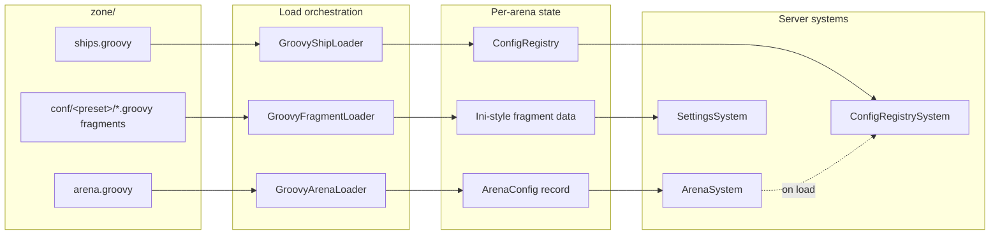
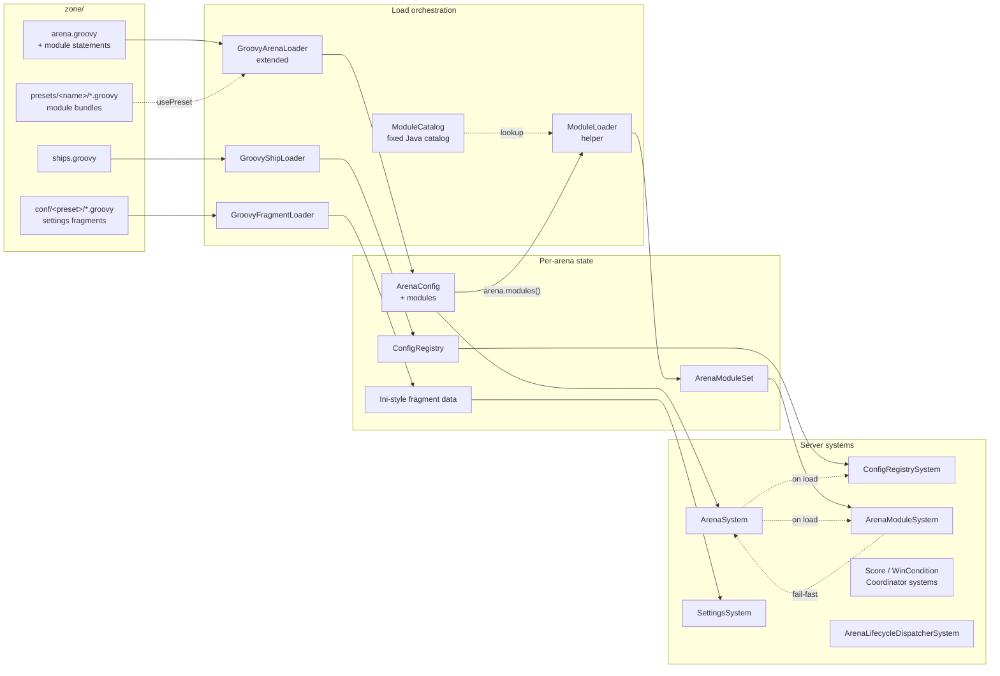
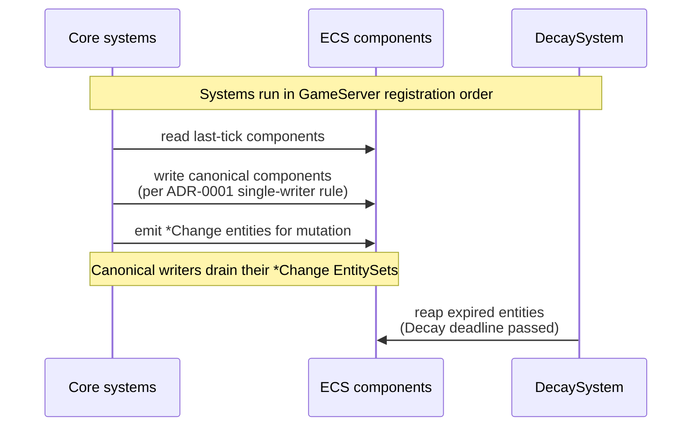
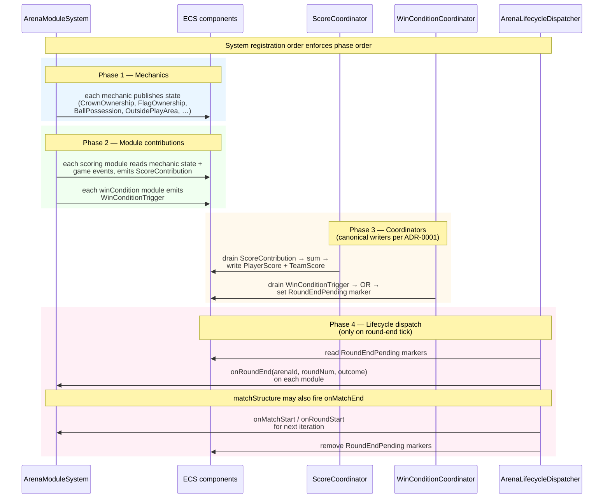
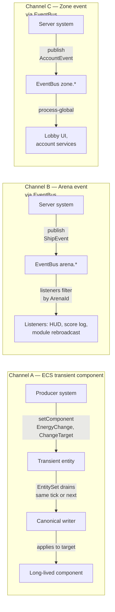
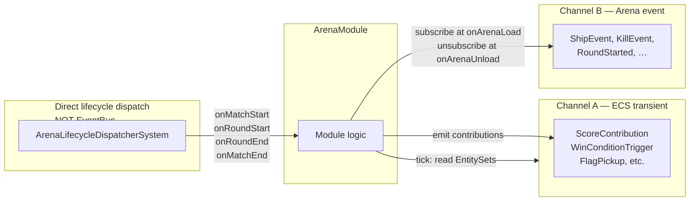
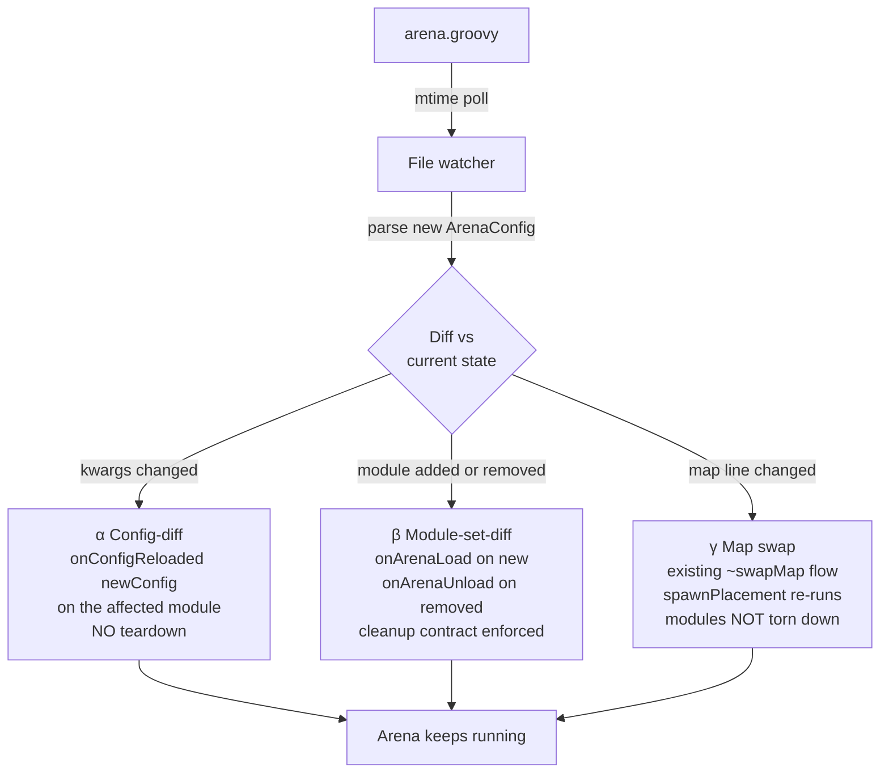

# Data flows

High-level data flows in Subspace Infinity. Each section pairs an
**AS-IS** view (today's codebase) with a **TO-BE** view (post-[ADR-0008](docs/adr/0008-arena-composition-and-modules.md)
arena composition + modules) so the shape of the change is visible at a
glance.

Diagrams are Mermaid; render natively on GitHub and in most IDEs (VS
Code: Markdown Preview Mermaid Support; JetBrains: Mermaid plugin).

This page is **descriptive**, not normative — the canonical decisions
live in CONTEXT.md and `docs/adr/`. If a diagram disagrees with an ADR,
the ADR wins.

---

## 1. Arena load — from `arena.groovy` to a live arena

### AS-IS



**Reads:** `arena.groovy` is settings only (map, shipsScript,
includeFragment, wallFriction, spawners, shipRestrictions). Arena
behaviour beyond settings = whatever core systems are wired in
`GameServer`. No per-arena modules, no gametype awareness.

### TO-BE



**Reads:** `arena.groovy` now declares both settings AND modules. The
`ModuleLoader` validates module identifiers against the explicit
`ModuleCatalog` and assembles a fully-validated `ArenaModuleSet` before
the arena is considered loaded. Unknown id / duplicate single-pick /
missing-dep / invalid-config all fail loudly during load, not at first
tick. Future external-Groovy modules append to `ModuleCatalog` at zone
start (Phase 3 — separate flow).

---

## 2. Server tick — what writes what, in what order

### AS-IS



**Reads:** Each canonical writer system owns one component type. Other
systems emit `*Change` entities (carrying `ChangeTarget` + payload);
the writer drains, applies, deletes (or unwinds on `Decay` reap).
No notion of game-event categories beyond the registered systems
themselves. No round/match structure.

### TO-BE



**Reads:** Same single-writer-per-component discipline as today, but
scaled up: many modules emit *transient contributions*, one
*coordinator* per layered category writes the canonical component.
Mechanics publish state in phase 1 so phase 2 modules read fully-
published mechanic state. Phase 4 only runs on round-end ticks; the
dispatcher reads the coordinator's marker and calls lifecycle hooks
directly (no EventBus indirection).

---

## 3. Communication channels — three planes, picked by shape

### AS-IS (already per [ADR-0003](docs/adr/0003-communication-channels.md))



**Reads:** Three planes for three shapes of communication. Mutation
requests = Channel A (queryable, atomic). Arena-scoped notifications =
Channel B (HUD, replay, score log). Zone-scoped lifecycle = Channel C
(login, account, master server).

### TO-BE — modules use all three, with no new channels



**Reads:** Modules read ECS components like any system and subscribe
to the per-arena EventBus for arena events — no new game-event hooks
on `ArenaModule`. The only direct-dispatch surface is *lifecycle* hooks
(load/match/round/unload) — these are framework calls, not bus events,
because their atomicity inside one tick is load-bearing for round-reset
correctness. This preserves CONTEXT.md's *Module extensibility
principle*: powerful tools, trust the module.

---

## 4. Hot-reload — three flavours

### AS-IS

```mermaid
flowchart LR
  FILE[arena.groovy or<br/>conf/&lt;preset&gt;/*.groovy] -->|mtime poll<br/>every N seconds| WATCH[File watcher<br/>in ArenaSystem]
  WATCH -->|on change| RELOAD[ConfigRegistrySystem.load<br/>arenaId arenaConfig]
  RELOAD -->|atomic swap| CR[New ConfigRegistry snapshot]
  CR -. consumers re-read .-> CONSUME[Consuming systems]
  RELOAD -. ships.groovy only .-> REPROJECT[ShipSpawnSystem.reprojectAll]
```

**Reads:** Settings hot-reload is poll-based, atomic-swap. Ships re-
project so live ships pick up new stats without respawn. No notion of
module-set diffs because there are no modules.

### TO-BE — three flavours, all on the same mtime poll



**Reads:** Three flavours of hot-reload, all triggered by the same
mtime poll. (α) is the cheapest — just kwargs change, module instance
updates internally, no player disruption. (β) is the test bed for the
future Phase-3 Groovy loader; the cleanup contract on `onArenaUnload`
ensures removed modules don't leak components. (γ) reuses the existing
`~swapMap` flow.

---

## 5. Phase-3 future — external-author Groovy modules

Diagrams above are Phase 1 + Phase 2 of [`arena-modules/PRD.md`](.scratch/arena-modules/PRD.md). The
Phase-3 extension surface ([`groovy-module-loader/PRD.md`](.scratch/groovy-module-loader/PRD.md)) appends
to the framework without changing it:

```mermaid
flowchart LR
  AUTHOR[zone/&lt;author-modules&gt;/&lt;name&gt;/module.groovy] -->|compile on<br/>zone start| LOADER[GroovyModuleLoader]
  LOADER -->|register in| MC[ModuleCatalog<br/>existing]
  MC -. arena.groovy references<br/>by string id .-> AG[arena.groovy]
  AG -. arena load .-> SAME[ArenaModuleSystem<br/>same framework, no changes]
```

**Reads:** Phase 3 doesn't add a parallel loader path; it appends to
the same catalog the Phase-1 framework already consults. Arena authors
reference external modules by string id exactly like built-in ones.
This is what makes the framework worth landing first — Phase 3's job
shrinks to compile + register.

---

## See also

- [ADR-0008](docs/adr/0008-arena-composition-and-modules.md) — the decision shape behind the TO-BE diagrams.
- [ADR-0001](docs/adr/0001-ecs-component-model.md) — canonical writer rule that the coordinator pattern preserves.
- [ADR-0003](docs/adr/0003-communication-channels.md) — three communication planes (depicted in section 3).
- [ADR-0004](docs/adr/0004-settings-pipeline.md) — settings pipeline hot-reload (extended in section 4).
- [`.scratch/arena-modules/PRD.md`](.scratch/arena-modules/PRD.md) — implementation PRD for the framework + first consumer.
- [`.scratch/groovy-module-loader/PRD.md`](.scratch/groovy-module-loader/PRD.md) — Phase-3 external-author extension PRD.
- `CONTEXT.md` — glossary for every term in these diagrams.
