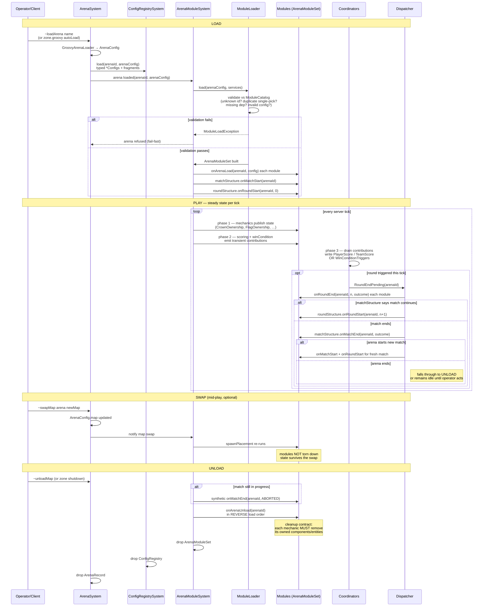
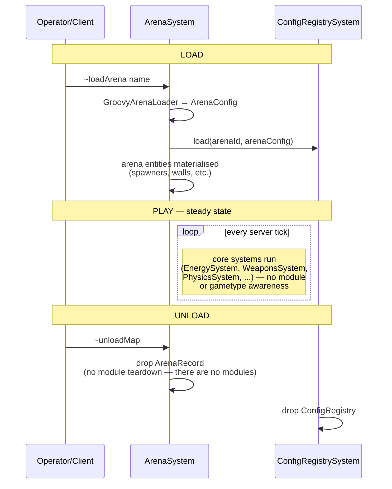
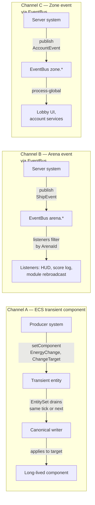
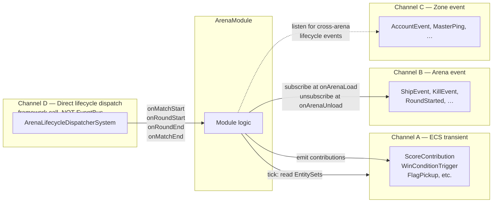
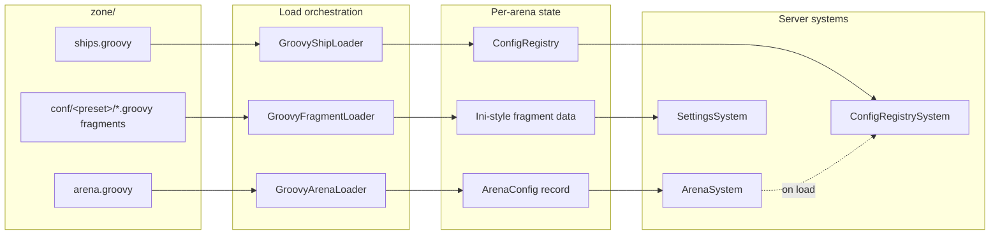
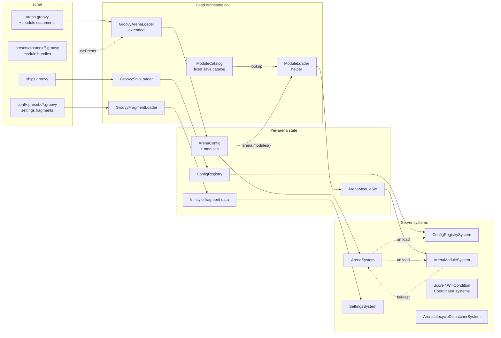
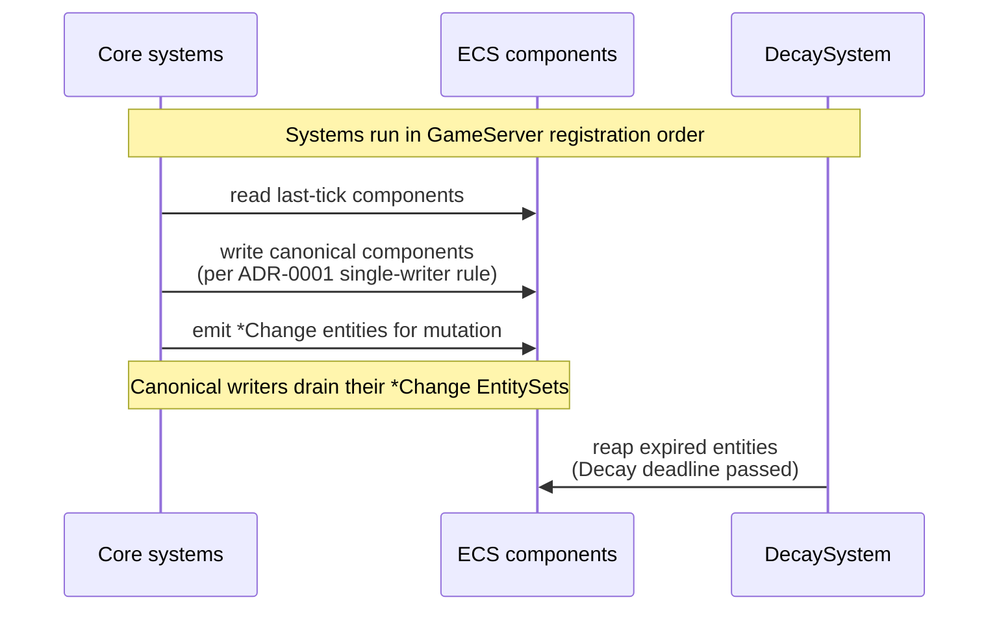
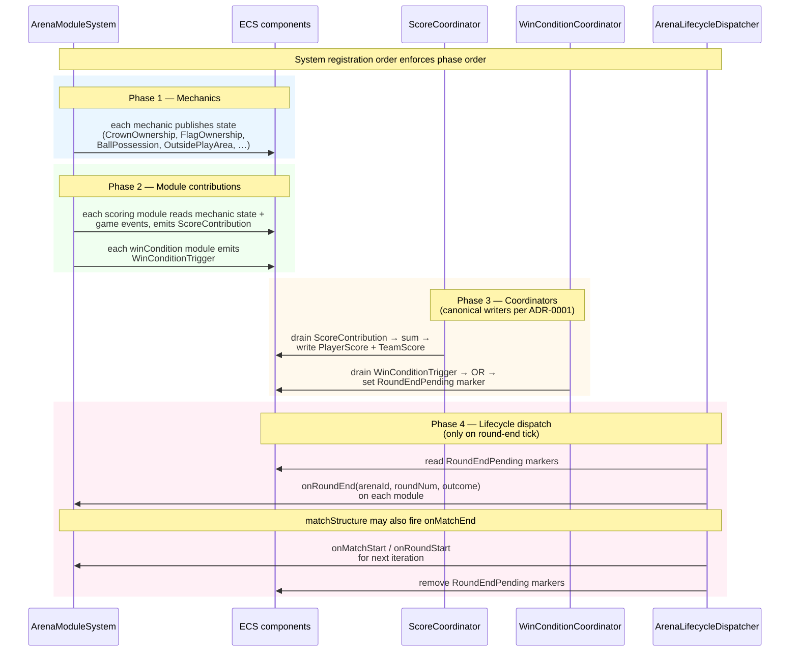
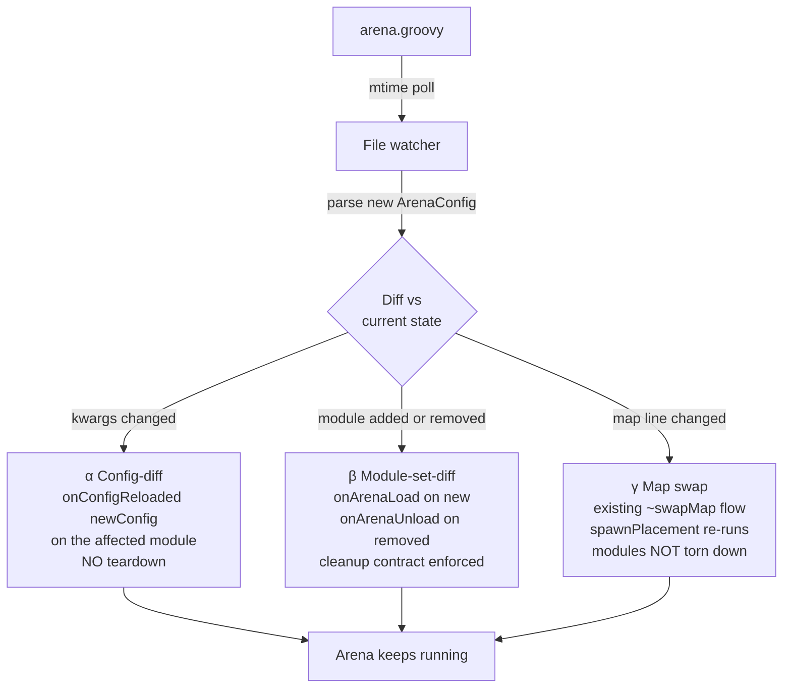

# Data flows

High-level data flows in Subspace Infinity. Each section pairs an
**AS-IS** view (today's codebase) with a **TO-BE** view (post-[ADR-0008](docs/adr/0008-arena-composition-and-modules.md)
arena composition + modules) so the shape of the change is visible at a
glance.

Diagrams are Mermaid; render natively on GitHub and in most IDEs (VS
Code: Markdown Preview Mermaid Support; JetBrains: Mermaid plugin).

This page is **descriptive**, not normative — the canonical decisions
live in CONTEXT.md and `docs/adr/`. If a diagram disagrees with an ADR,
the ADR wins.

Layout: sections 1-3 are the three primary lifecycle views (zone,
arena, communication). Sections 4-7 are deep-dive detail of specific
sub-flows referenced by the primary views.

---

## 1. Zone lifecycle — boot / play / shutdown

The server process's full lifecycle, from JVM start to clean exit. The
shape is largely unchanged by ADR-0008; modules slot into the existing
boot ordering between *systems registered* and *arenas auto-loaded*.

```mermaid
sequenceDiagram
  participant Proc as JVM process
  participant GS as GameServer
  participant Cfg as zone.groovy
  participant Sys as Systems<br/>(GameSystemManager)
  participant Net as NetworkServer
  participant Loop as Mainloop

  Note over Proc,Loop: BOOT
  Proc->>GS: main(args)
  GS->>Cfg: GroovyZoneLoader → ZoneConfig<br/>(autoLoad, enterSpawn, defaults)
  GS->>Sys: register systems in order:<br/>ArenaSystem, ConfigRegistrySystem,<br/>ArenaModuleSystem, ScoreCoordinator,<br/>WinConditionCoordinator,<br/>ArenaLifecycleDispatcher, DecaySystem, …
  GS->>Sys: initialize() each system
  loop for each arena in ZoneConfig.autoLoad
    GS->>Sys: ArenaSystem.loadArena(name)
    Note right of Sys: triggers full<br/>arena-load flow<br/>(see section 2)
  end
  GS->>Net: NetworkServer.start()<br/>accept connections
  GS->>Loop: tick loop starts

  Note over Proc,Loop: PLAY (steady state)
  loop every server tick
    Loop->>Sys: update(time) on each system<br/>in registration order
  end
  Note over Net: connections come and go<br/>via login/leave RMI<br/>(account auth → session bind →<br/>~loadArena or auto-route)

  Note over Proc,Loop: SHUTDOWN
  Proc->>GS: SIGTERM / shutdown command
  GS->>Net: NetworkServer.stop()<br/>refuse new sessions
  loop for each loaded arena
    GS->>Sys: ArenaSystem.unloadArena(name)
    Note right of Sys: triggers full<br/>arena-unload flow<br/>(see section 2)
  end
  GS->>Sys: terminate() each system<br/>in REVERSE registration order
  GS->>Proc: JVM exits cleanly
```

**Reads:**
- **Boot** registers systems in the exact order ADR-0008 specifies; the four new module-framework systems slot between settings and game-mechanics infrastructure.
- **Play** is just the tick loop — same as today; the per-tick detail (4 phases inside `ArenaModuleSystem.update()` + coordinators) lives in section 5.
- **Shutdown** unloads arenas first (so module `onArenaUnload` hooks fire while the EventBus and EntityData are still live), *then* terminates systems in reverse-registration order (so canonical writers terminate after their consumers).

**No AS-IS variant shown:** the zone lifecycle is structurally identical today; ADR-0008 just expands the systems registered in step 2 and the per-arena work done in step 4.

---

## 2. Arena lifecycle — load / play / round-end / match-end / swap / unload

The complete temporal story for one arena, from `~loadArena` to
teardown. This is where ADR-0008's contribution is most visible — the
play phase becomes a structured 4-phase tick, round/match transitions
become explicit dispatched lifecycle events, and unload enforces the
cleanup contract.

### TO-BE (post-ADR-0008)



**Reads:**
- **LOAD** is fail-fast: an arena either loads cleanly with a fully-built `ArenaModuleSet` or it refuses and tells the operator why.
- **PLAY** is the 4-phase tick. The `opt round triggered` block expands into phase 4; on quiet ticks (no round-end) only phases 1-3 run.
- **SWAP** keeps modules intact — only the map changes. `spawnPlacement` re-runs to put players back in valid positions.
- **UNLOAD** is the cleanup-contract enforcement point. Modules are torn down in *reverse* load order so a module that depends on another's state (e.g., a scoring module observing flag ownership) cleans up first.

### AS-IS — today's much shorter story



**Reads:** Today arenas are basically a tunable settings bundle. There's no concept of round, match, gametype, or per-arena behaviour swap. Kills broadcast as `onPlayerKilled` events but nothing consumes them to score. The TO-BE diagram introduces every numbered element that's absent here.

---

## 3. Communication channels — three planes, picked by shape

The three communication planes already documented in [ADR-0003](docs/adr/0003-communication-channels.md), shown here with how ADR-0008 modules plug into each. **No new channels are introduced** — modules are first-class users of the same three planes core systems already use.

### AS-IS (already per ADR-0003)



**Reads:** Three planes for three shapes of communication. Mutation requests = Channel A (queryable, atomic, in-tick). Arena-scoped notifications = Channel B (HUD, replay, score log). Zone-scoped lifecycle = Channel C (login, account, master server).

### TO-BE — modules use all three, plus a fourth (lifecycle) for round/match boundaries



**Reads:**
- **Channel A** (ECS transient) is how modules *request* mutations and emit *contributions* that coordinators drain into canonical components. Same shape ADR-0001 already uses for `*Change` entities — modules just write more of them.
- **Channel B** (arena EventBus) is how modules *consume* in-arena events. The per-arena `EventBus` is injected into each module at instantiation; modules subscribe in `onArenaLoad` and unsubscribe in `onArenaUnload`.
- **Channel C** (zone EventBus) is rarely used by modules but available for cross-arena visibility (e.g. a global stat-tracker module observing kills across arenas).
- **Channel D** (lifecycle dispatch, new) is *not* an EventBus channel — it's a framework-level method call. Round/match boundary atomicity is load-bearing for round-reset correctness, so lifecycle hooks ship through direct dispatch, not a queue.

**Picking the right channel** (per ADR-0003, restated for modules):
- *"I need to request a mutation and have it land atomically this tick or next."* → Channel A.
- *"I need to react when something already happened in this arena."* → Channel B.
- *"I need to react to something at the server / account / zone level."* → Channel C.
- *"I need to do round-/match-start/end work."* → Channel D — override the `ArenaModule` lifecycle hooks; the framework calls them.

---

## 4. Detail — `arena.groovy` → `ArenaModuleSet` orchestration

Deep-dive of the LOAD phase from section 2's arena lifecycle. Shows the file-loader / typed-config / registry layout end to end.

### AS-IS



**Reads:** `arena.groovy` is settings only (map, shipsScript, includeFragment, wallFriction, spawners, shipRestrictions). Arena behaviour beyond settings = whatever core systems are wired in `GameServer`. No per-arena modules, no gametype awareness.

### TO-BE



**Reads:** `arena.groovy` now declares both settings AND modules. The `ModuleLoader` validates module identifiers against the explicit `ModuleCatalog` and assembles a fully-validated `ArenaModuleSet` before the arena is considered loaded. Unknown id / duplicate single-pick / missing-dep / invalid-config all fail loudly during load, not at first tick. Future external-Groovy modules append to `ModuleCatalog` at zone start (Phase 3 — see section 7).

---

## 5. Detail — server tick phases

Deep-dive of the PLAY loop from section 2's arena lifecycle. Shows the 4-phase tick discipline that enforces ADR-0001 single-writer rule under layered-module contributions.

### AS-IS



**Reads:** Each canonical writer system owns one component type. Other systems emit `*Change` entities (carrying `ChangeTarget` + payload); the writer drains, applies, deletes (or unwinds on `Decay` reap). No notion of game-event categories beyond the registered systems themselves. No round/match structure.

### TO-BE



**Reads:** Same single-writer-per-component discipline as today, but scaled up: many modules emit *transient contributions*, one *coordinator* per layered category writes the canonical component. Mechanics publish state in phase 1 so phase 2 modules read fully-published mechanic state. Phase 4 only runs on round-end ticks; the dispatcher reads the coordinator's marker and calls lifecycle hooks directly (no EventBus indirection — that's Channel D from section 3).

---

## 6. Detail — hot-reload flavours

Deep-dive of how arena.groovy edits propagate without a server restart. Three distinct flavours, all triggered by the same existing mtime-poll file-watcher.

### AS-IS

```mermaid
flowchart LR
  FILE[arena.groovy or<br/>conf/&lt;preset&gt;/*.groovy] -->|mtime poll<br/>every N seconds| WATCH[File watcher<br/>in ArenaSystem]
  WATCH -->|on change| RELOAD[ConfigRegistrySystem.load<br/>arenaId arenaConfig]
  RELOAD -->|atomic swap| CR[New ConfigRegistry snapshot]
  CR -. consumers re-read .-> CONSUME[Consuming systems]
  RELOAD -. ships.groovy only .-> REPROJECT[ShipSpawnSystem.reprojectAll]
```

**Reads:** Settings hot-reload is poll-based, atomic-swap. Ships re-project so live ships pick up new stats without respawn. No notion of module-set diffs because there are no modules.

### TO-BE — three flavours, all on the same mtime poll



**Reads:** Three flavours of hot-reload, all triggered by the same mtime poll. (α) is the cheapest — just kwargs change, module instance updates internally, no player disruption. (β) is the test bed for the future Phase-3 Groovy loader; the cleanup contract on `onArenaUnload` ensures removed modules don't leak components. (γ) reuses the existing `~swapMap` flow.

---

## 7. Detail — Phase 3 future: external-author Groovy modules

Sections 1-6 cover Phase 1 + Phase 2 of [`arena-modules/PRD.md`](.scratch/arena-modules/PRD.md). The Phase-3 extension surface ([`groovy-module-loader/PRD.md`](.scratch/groovy-module-loader/PRD.md)) appends to the framework without changing it:

```mermaid
flowchart LR
  AUTHOR[zone/&lt;author-modules&gt;/&lt;name&gt;/module.groovy] -->|compile on<br/>zone start| LOADER[GroovyModuleLoader]
  LOADER -->|register in| MC[ModuleCatalog<br/>existing]
  MC -. arena.groovy references<br/>by string id .-> AG[arena.groovy]
  AG -. arena load .-> SAME[ArenaModuleSystem<br/>same framework, no changes]
```

**Reads:** Phase 3 doesn't add a parallel loader path; it appends to the same catalog the Phase-1 framework already consults. Arena authors reference external modules by string id exactly like built-in ones. This is what makes the framework worth landing first — Phase 3's job shrinks to compile + register.

---

## See also

- [ADR-0008](docs/adr/0008-arena-composition-and-modules.md) — the decision shape behind the TO-BE diagrams.
- [ADR-0001](docs/adr/0001-ecs-component-model.md) — canonical writer rule that the coordinator pattern preserves.
- [ADR-0003](docs/adr/0003-communication-channels.md) — three communication planes (depicted in section 3).
- [ADR-0004](docs/adr/0004-settings-pipeline.md) — settings pipeline hot-reload (extended in section 6).
- [`.scratch/arena-modules/PRD.md`](.scratch/arena-modules/PRD.md) — implementation PRD for the framework + first consumer.
- [`.scratch/groovy-module-loader/PRD.md`](.scratch/groovy-module-loader/PRD.md) — Phase-3 external-author extension PRD.
- `CONTEXT.md` — glossary for every term in these diagrams.
